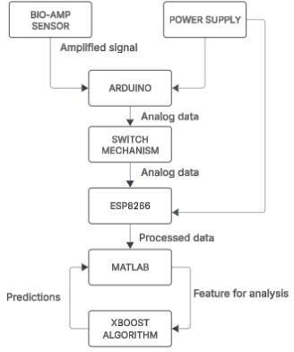
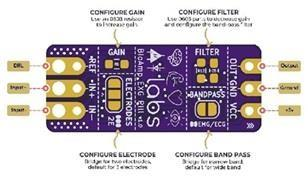
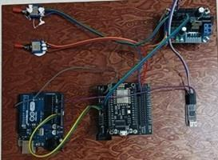
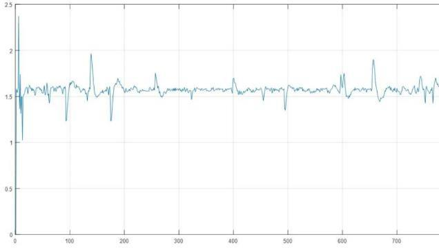
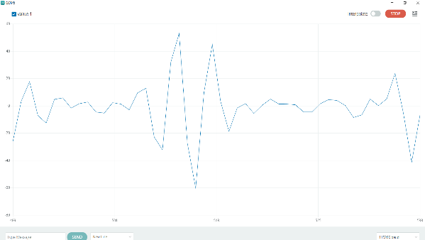
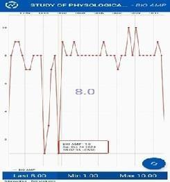
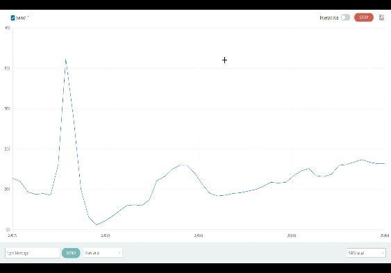
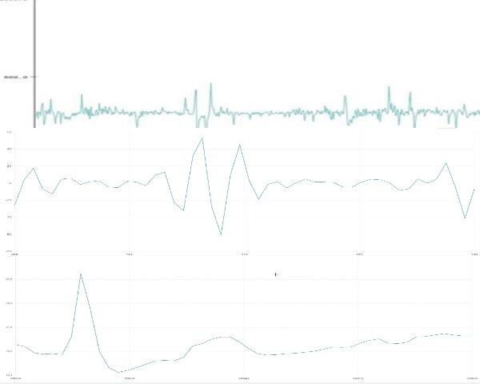

# RealTime-BioFusion
*A portable system for real-time ECG, EEG, and EMG signal acquisition and analysis.*


[](https://github.com/Karthika046/RealTime-BioFusion/stargazers)
[](https://github.com/Karthika046/RealTime-BioFusion/network/members)
[](https://github.com/Karthika046/RealTime-BioFusion/issues)
[](https://github.com/Karthika046/RealTime-BioFusion/commits/main)

## Table of Contents
1. [Overview](#overview)
2. [Features](#features)
3. [Architecture Diagram](#architecture-diagram)
4. [Tech Stack](#tech-stack)
5. [System Requirements](#system-requirements)
6. [Installation / Setup](#installation)
7. [Usage](#usage)
8. [Dataset / Input Format](#dataset-input-format)
9. [Output / Results](#output-results)
10. [Project Structure](#project-structure)
11. [Research / Algorithms Used](#research-algorithms-used)
12. [Limitations & Future Enhancements](#limitations-future-enhancements)
13. [Diagrams & Waveforms (from paper)](#diagrams-waveforms)
14. [Contributors / Authors](#contributors)
15. [License](#license)

---

## Overview
RealTime-BioFusion is a microcontroller-based system that integrates **ECG**, **EEG**, and **EMG** signal acquisition using **BioAmp**, **Arduino UNO**, and **ESP8266**. It enables wireless streaming, signal filtering, and machine-learning analysis (XGBoost) for fatigue detection and performance optimization in para-athletes. The repository also includes the original conference paper (see `docs/conference-paper.pdf`).

## Features
- Real-time ECG, EEG, and EMG acquisition
- Wireless data transmission via ESP8266 / NodeMCU
- MATLAB-based signal processing and feature extraction
- XGBoost classification for normal vs. fatigue states
- Visualization of combined outputs and individual waveforms

## Architecture Diagram


**Flow:** Electrodes → BioAmp → Arduino (ADC) → ESP8266 (Wi‑Fi) → MATLAB (feature extraction) → XGBoost (classification) → Results

## Tech Stack
**Hardware:** Arduino UNO, ESP8266 NodeMCU, BioAmp, Ag/AgCl electrodes

**Software:** Arduino IDE, MATLAB (Signal Processing), optional LabVIEW

**ML Model:** XGBoost

## System Requirements
**Hardware:** Arduino UNO, ESP8266/NodeMCU, BioAmp, ECG/EEG/EMG electrodes, 5V USB or 7–12V Vin supply

**Software:** Arduino IDE, MATLAB R2021+ (Signal Processing Toolbox), Python (optional)

## Installation / Setup
```bash
git clone https://github.com/<username>/RealTime-BioFusion.git
cd RealTime-BioFusion
```

## Usage
1. **Hardware wiring:** Electrodes → BioAmp → Arduino `A0`; Arduino UART → ESP8266.
2. **Arduino acquisition:** open `src/arduino/biosignal_capture.ino` → select board/port → upload.
3. **ESP8266 streaming:** open `src/esp8266/data_transmission.ino` → set SSID/PASS → upload.
4. **MATLAB processing:** run `src/matlab/signal_processing.m` followed by `xgboost_pipeline.m`. Outputs saved to `results/`.

## Dataset / Input Format
CSV format per signal with headers: `timestamp, value`. Sample files are provided in `data/` as `sample_ecg.csv`, `sample_eeg.csv`, `sample_emg.csv`.

## Output / Results
- **ECG:** clear P–QRS–T complexes; avg heart rate ~68 ± 12 BPM.
- **EEG:** alpha (8–13 Hz) & beta (13–30 Hz) patterns with exertion shifts.
- **EMG:** RMS amplitude ~0.2–1.5 mV during contraction.
- **Model:** XGBoost accuracy ~92% for normal vs. fatigue states.

## Project Structure
```text
RealTime-BioFusion/
├─ README.md
├─ docs/
│  ├─ conference-paper.pdf
│  └─ figures/ (extracted diagrams & waveforms)
├─ src/ (arduino, esp8266, matlab code)
├─ data/ (sample CSVs)
└─ results/ (plots, combined outputs)
```

## Research / Algorithms Used
- **Filtering:** band-pass, notch/DWT for noise reduction.
- **Feature extraction:** HRV (ECG), band powers (EEG), RMS/median frequency (EMG).
- **Classification:** XGBoost implemented in MATLAB for state detection.

## Limitations & Future Enhancements
- Dependence on MATLAB; future edge inference on ESP32/ESP8266.
- Electrode placement sensitivity; explore dry electrodes & adaptive filtering.
- Battery optimization; add low-power modes & duty cycling.

## Diagrams & Waveforms (from paper)
The following images were extracted from `docs/conference-paper.pdf` and placed in `docs/figures/`.

- Page 2 Image 1

  

- Page 3 Image 1

  

- Page 3 Image 2

  

- Page 3 Image 3

  

- Page 3 Image 4

  

- Page 3 Image 5

  

- Page 4 Image 1

  

- Page 4 Image 2

  

- Page 5 Image 1

  

## Contributors / Authors
- Karthika Perumal (Electronics and Communication Engineering)
- R. Suhanth (Electronics and Communication Engineering)
- Santhiya R (Electronics and Communication Engineering)
- Dr. S. Deivanayagi (Associate Professor, ECE)

## License
This project is released under the MIT License.
